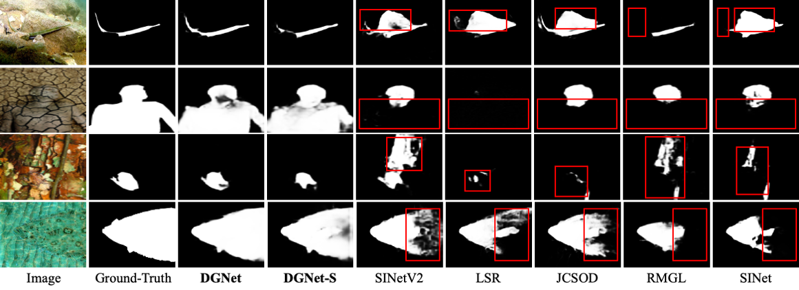

# 
`Deep Gradient Learning for Efficient Camouflaged Object Detection`

> **Authors:**
> [Ge-Peng Ji](https://github.com/GewelsJI),
> [Deng-Ping Fan](https://dengpingfan.github.io/),
> [Yu-Cheng Chou](https://github.com/johnson111788),
> [Dengxin Dai](),
> [Alexander Liniger]() &
> [Luc Van Gool]().

## 1. Features

- **Introduction.** This repository contains the source code, prediction results, and evaluation toolbox of our Deep
  Gradient Network, also called DGNet ([arXiv]()).

- **Highlights.** We achieve SOTA in the field of COD via gradient-induced transition (GIT) module and object gradient
  supervision framework. Please refer to our paper for more details.

> If you have any questions about our paper, feel free to contact me via e-mail (gepengai.ji@gmail.com).
> And if you are using our code and evaluation toolbox for your research, please cite this paper ([BibTeX](#4-citation)).

## 2. :fire: NEWS :fire:

- [2022/05/25] Creating repository.

## 3. Overview

      
    <em> 
    Figure 1: Overall pipeline of the proposed DGNet, It consists of two connected learning branches, i.e., context encoder and texture encoder. 
    Then, we introduce a gradient-induced transition (GIT) to collaboratively aggregate the feature that is derived from the above two encoders. Finally, a neighbor connected decoder (NCD) [1] is adopted to generate the prediction.
    </em>

      
    <em> 
    Figure 2: Illustration of the proposed gradient-induced transition (GIT). 
    It use a soft grouping strategy to provide parallel nonlinear projections at multiple fine-grained sub-spaces, which enables the network to probe multi-source representations jointly.
    </em>

      
    <em> 
    Figure 3: We present the scatter relationship between the performance weighted F-measure and parameters of all competitors on CAMO-Test.
    These scatters are in various colors for better visual recognition and are also corresponding to the histogram (Right).
    The larger size of the coloured scatter point, the heavier the model parameter.
    (Right) We also report the parallel histogram comparison of model's parameters, MACs, and performance.
    </em>

      
    <em> 
    Figure 3: Visualization of popular COD baselines and the proposed DGNet. 
    Interestingly, these competitors fail to provide complete segmentation results for the camouflaged objects that touch the image boundary. 
    By contrast, our approach can precisely locate the target region and provide exact predictions due to the gradient learning strategy.
    </em>

> References of neighbor connected decoder (NCD) benchmark works 
> [1] Concealed Object Detection. TPAMI, 2022. ([Code Page](https://github.com/GewelsJI/SINet-V2)) 

## 4. Proposed Framework

### 4.1. Training/Testing

The training and testing experiments are conducted using [PyTorch](https://github.com/pytorch/pytorch) with a single
GeForce RTX TITAN GPU of 24 GB Memory.

> Note that our model also supports low memory GPU, which means you should lower the batch size.

1. Prerequisites:

   Note that DGNet is only tested on Ubuntu OS with the following environments. It may work on other operating systems (
   i.e., Windows) as well but we do not guarantee that it will.

    + Creating a virtual environment in terminal: `conda create -n DGNet python=3.6`.

    + Installing necessary packages: `pip install -r requirements.txt
      `

1. Prepare the data:

    + downloading testing dataset and move it into `./dataset/TestDataset/`, which can be found
      in [Baidu Drive](https://pan.baidu.com/s/1Gg9zco1rt8314cuemqMFBg) (Password: 3wih)
      , [Google Drive](https://drive.google.com/file/d/1LraHmnmgqibzqpqTi4E4l1O2MTusJjrZ/view?usp=sharing).
    + downloading training dataset and move it into `./dataset/TrainDataset/`, which can be found
      in [Baidu Drive](https://pan.baidu.com/s/175Xx6SQbN2YE9A_ImtTM5A) (Password: dllm)
      , [Google Drive](https://drive.google.com/file/d/1VLKI5pJdM6p4fW2cBZ_2EnoykbQeAHOe/view?usp=sharing).
    + downloading pretrained weights and move it into `./snapshot/DGNet/Net_epoch_best.pth`, which can be found in
      this [Baidu Drive]() (Password: ), [Google Drive]().
    + downloading pretrained weights and move it into `./snapshot/DGNet-S/Net_epoch_best.pth`, which can be found in
      this [Baidu Drive]() (Password: ), [Google Drive]()
    + downloading EfficientNet-B4 weights on ImageNet
      dataset [Baidu Drive](https://pan.baidu.com/s/1xBC6qiXjC4oSztQNy_1Cmg) (Password: 66so)
      , [Google Drive](https://drive.google.com/file/d/1XrUOmgB86L84JefoNq0gq2scBZjGaTkm/view?usp=sharing).
    + downloading EfficientNet-B1 weights on ImageNet
      dataset [Baidu Drive](https://pan.baidu.com/s/1ORAVErkwvgqG0J3qX79pLw) (Password: 0wa9)
      , [Google Drive](https://drive.google.com/file/d/1niq1xi5IMdBToyS8kUzoppFIqTYM9kRr/view?usp=sharing)

1. Training Configuration:

    + Assigning your costumed path, like `--save_path `, `--train_root` and `--val_root` in `MyTrain.py`.
    + Just enjoy it via run `python MyTrain.py` in your terminal.

1. Evaluation Configuration:

    + Assigning your costumed path, like `--gt_root `, `--pred_root`,`--data_lst` and `--model_lst` in `MyEval.py`.
    + You can choose to evaluate the model by default setting or evaluate only the super-/subclass by configure
      the `--eval_type` in `MyEval.py`.
    + Just enjoy it via run `python MyEval.py` in your terminal.

1. Testing Configuration:

    + After you download all the pre-trained model and testing dataset, just run `MyTest.py` to generate the final
      prediction map:
      replace your trained model directory (`--snap_path`).

    + Just enjoy it!

### 3.2 Evaluating your trained model:

One-key evaluation is written in MATLAB code `./eval/`, please follow this the instructions in `./eval/main.m` and just
run it to generate the evaluation results in `./res/`.

### 3.3 Pre-computed maps:

They can be found in [download link]().

## 4. Citation

Please cite our paper if you find the work useful:

    @article{ji2022gradient,
          title={Deep Gradient Learning for Efficient Camouflaged Object Detection},
          author={Ji, Ge-Peng and Fan, Deng-Ping and Chou, Yu-Cheng and Dai, Dengxin and Liniger, Alexander and Van Gool, Luc},
          journal={arXiv},
          year={2022}
    } 

---

**[⬆ back to top](#0-preface)**
