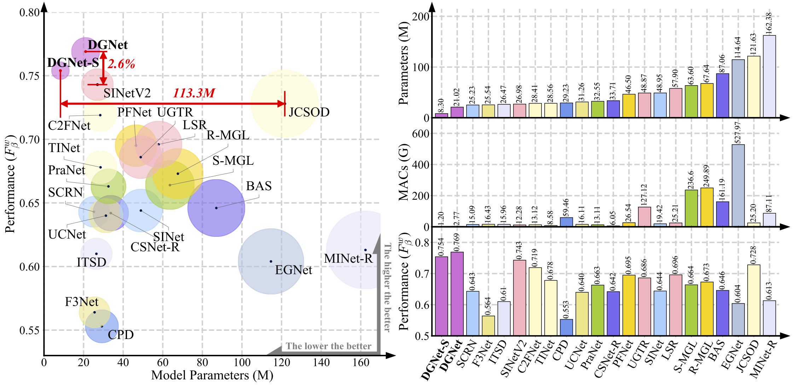
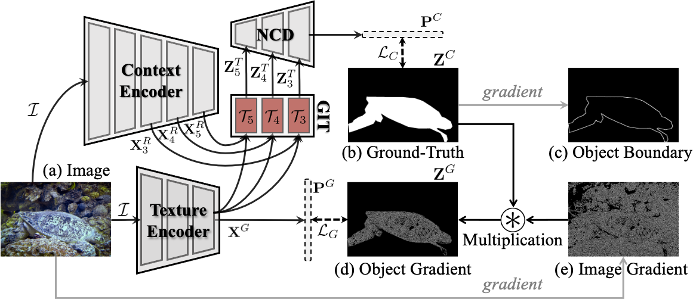
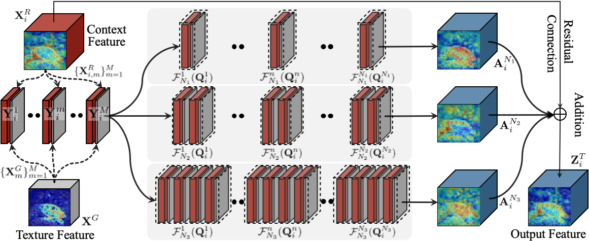
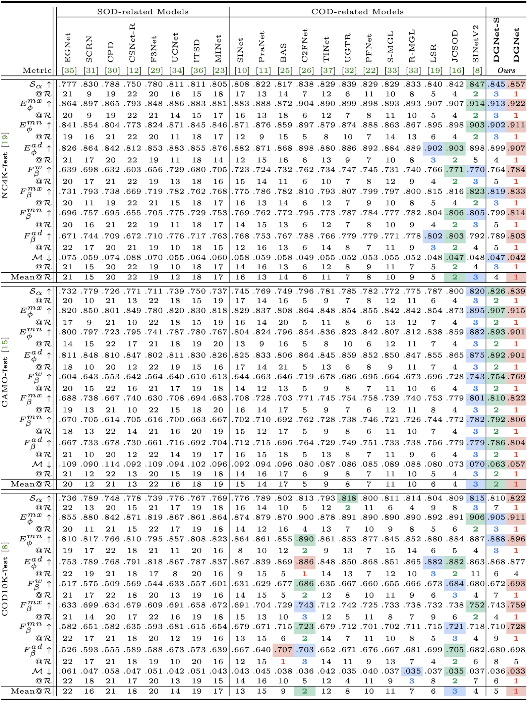
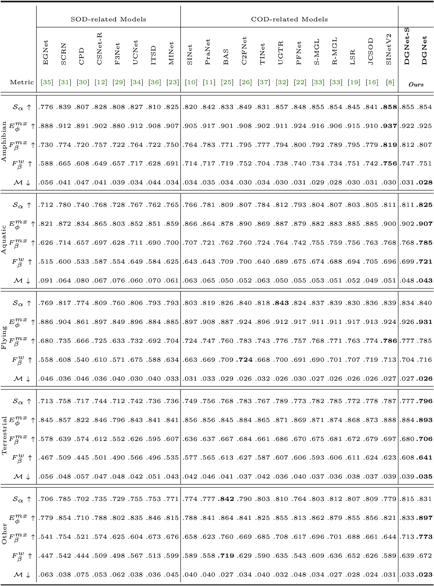
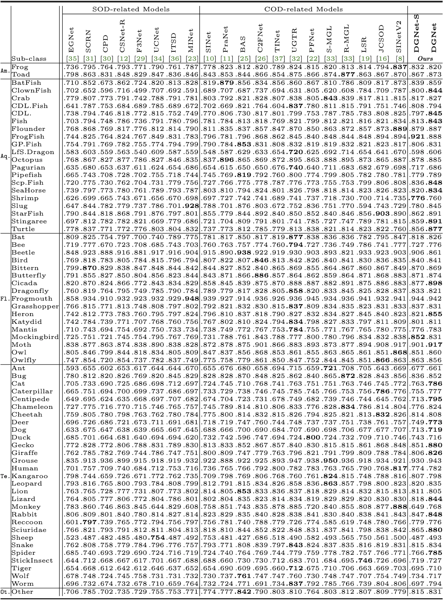

# 
`Deep Gradient Learning for Efficient Camouflaged Object Detection (MIR 2023)`

> **Authors:**
> [Ge-Peng Ji](https://github.com/GewelsJI),
> [Deng-Ping Fan](https://dengpingfan.github.io/),
> [Yu-Cheng Chou](https://github.com/johnson111788),
> [Dengxin Dai](https://vas.mpi-inf.mpg.de/dengxin/),
> [Alexander Liniger](https://people.ee.ethz.ch/~aliniger/), &
> [Luc Van Gool](https://ee.ethz.ch/the-department/faculty/professors/person-detail.OTAyMzM=.TGlzdC80MTEsMTA1ODA0MjU5.html).

This official repository contains the source code, prediction results, and evaluation toolbox of Deep Gradient Network (accepted by Machine Intelligence Research 2023), also called DGNet. The technical report could be found at [arXiv](https://arxiv.org/abs/2205.12853).

## 1. Features

      
    <em> 
    Figure 1: We present the scatter relationship between the performance weighted F-measure and parameters of all competitors on CAMO-Test. These scatters are in various colors for better visual recognition and are also corresponding to the histogram (Right).
    The larger size of the coloured scatter point, the heavier the model parameter. (Right) We also report the parallel histogram comparison of model's parameters, MACs, and performance.
    </em>

- **Novel supervision.** We propose to excavate the texture information via learning the object level gradient rather than using boundary-supervised or uncertainty-aware modeling.

- **Simple but efficient.** We decouple all the heavy designs as much as we can, yielding a simple but efficient framework. We hope this framework could be served as a baseline learning paradigm for the COD field.

- **Best trade-off.** Our vision is to achieve new SOTA with the best performance-efficiency trade-off on existing cutting-edge COD benchmarks.

## 2. :fire: NEWS :fire:

- [2022/11/03] We add the support for the [PVTv2](https://github.com/whai362/PVT) Transformer backbone, achieving excitied performance again on COD benchmark. Please enjoy it -> ([link](https://github.com/GewelsJI/DGNet/tree/main/lib_pytorch))
- [2022/08/06] Our paper has been accepted by [Machine Intelligence Research (MIR)](https://www.springer.com/journal/11633).
- [2022/05/30] :fire: We release the implementation of DGNet with different AI frameworks: [Pytorch-based](https://github.com/GewelsJI/DGNet/tree/main/jittor_lib) and [Jittor-based](https://github.com/GewelsJI/DGNet/tree/main/jittor_lib).
- [2022/05/30] Thank @Katsuya Hyodo for adding our model into [PINTO](https://github.com/PINTO0309/PINTO_model_zoo/tree/main/299_DGNet). This is a repository for storing models that have been inter-converted between various frameworks (e.g., TensorFlow, PyTorch, ONNX).
- [2022/05/25] Releasing the codebase of DGNet (Pytorch) and whole COD benchmarking results (20 models).
- [2022/05/23] Creating repository.

> This project is still work in progress, and we invite all to contribute in making it more acessible and useful. If you have any questions about our paper, feel free to contact me via e-mail (gepengai.ji@gmail.com & johnson111788@gmail.com & dengpfan@gmail.com). And if you are using our code and evaluation toolbox for your research, please cite this paper ([BibTeX](#4-citation)).

## 3. Proposed Framework

### 3.1. Overview

      
    <em> 
    Figure 2: Overall pipeline of the proposed DGNet, It consists of two connected learning branches, i.e., context encoder and texture encoder. 
    Then, we introduce a gradient-induced transition (GIT) to collaboratively aggregate the feature that is derived from the above two encoders. Finally, a neighbor connected decoder (NCD [1]) is adopted to generate the prediction.
    </em>

      
    <em> 
    Figure 3: Illustration of the proposed gradient-induced transition (GIT). 
    It use a soft grouping strategy to provide parallel nonlinear projections at multiple fine-grained sub-spaces, which enables the network to probe multi-source representations jointly.
    </em>

> References of neighbor connected decoder (NCD) benchmark works [1] Concealed Object Detection. TPAMI, 2023.  

### 3.2. Usage

We provide various versions for different deep learning platforms, including [PyTorch](https://github.com/pytorch/pytorch) and [Jittor](https://github.com/Jittor/jittor) libraries. Note that we only report the results of the Pytorch-based DGNet in our manuscript.

- For the Pytorch users, please refer to our [lib_pytorch](https://github.com/GewelsJI/DGNet/tree/main/lib_pytorch).

- For the Jittor users, please refer to our [lib_jittor](https://github.com/GewelsJI/DGNet/tree/main/lib_jittor).

### 3.4 COD Benchmark Results:

The prediction of our DGNet and DGNet-S can be found in [Pytorch](https://anu365-my.sharepoint.com/:u:/g/personal/u7248002_anu_edu_au/EcwgyI1KDnBDjoFMZCLNJkAB7GjBYGgvDPlBAruSAVCOxw?e=RrBvHd) / [Jitror](https://anu365-my.sharepoint.com/:u:/g/personal/u7248002_anu_edu_au/EbRmYVvdBIhEtRKWBUhzsNMBQ8F7Pnw7sUBAPDeN_Po_6A?e=crMmfP). The whole benchmark results can be found at [OneDrive](https://anu365-my.sharepoint.com/:u:/g/personal/u7248002_anu_edu_au/EXLiBgp9nGNApBw9im2xznsBJ_ryGEW7hkJlL92gNaRAAg?e=ktOw0B). Here are quantitative performance comparison from three perspectives.

      
    <em> 
    Figure 4: Quantitative results in terms of full metrics for cutting-edge competitors, including 8 SOD-related and 12 COD-related, on three test datasets: NC4K-Test, CAMO-Test, and COD10K-Test. @R means the ranking of the current metric, and Mean@R indicates the mean ranking of all metrics.
    </em>

      
    <em> 
    Figure 5: Super-classes (i.e., Amphibian, Aquatic, Flying, Terrestrial, and Other) on the COD10K-Test of the proposed methods (DGNet & DGNet-S) and other 20 competitors. Symbol \uparrow indicates the higher the score, the better, and symbol \downarrow indicates the lower, the better. The best score is marked with bold.
    </em>

      
    <em> 
    Figure 6: Sub-class results on COD10K-Test of 12 COD-related and 8 SOD-related baselines in terms of structure measure (\mathcal{S}_\alpha), where Am., Aq., Fl., Te., and  Ot. represent Amphibian, Aquatic, Flying, Terrestrial, and Other, respectively. CDL., GP.Fish, and LS.Dragon denote Crocodile, and  GhostPipeFish, LeafySeaDragon, respectively. The best score is marked with bold. 
    </em>

## 4. Citation

Please cite our paper if you find the work useful:

    @article{ji2022gradient,
      title={Deep Gradient Learning for Efficient Camouflaged Object Detection},
      author={Ji, Ge-Peng and Fan, Deng-Ping and Chou, Yu-Cheng and Dai, Dengxin and Liniger, Alexander and Van Gool, Luc},
      journal={Machine Intelligence Research},
      year={2023}
    } 
