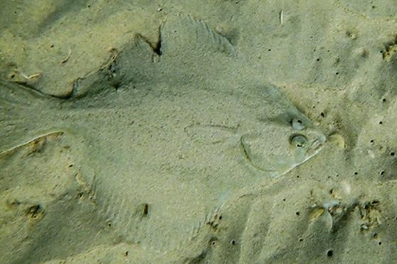

# MindX SDK -- 伪装目标分割参考设计案例

## 1 案例概述

### 1.1 概要描述

伪装目标检测（Camouflaged Object Detection, COD）旨在分割具有人工或者自然模式的目标，这些目标能够“完美地”融入背景之中，以避免被发现。一些成功应用已展现出伪装目标检测任务的科学和工业价值，例如：医疗图像分析（包括：息肉和肺部感染分割）、视频理解（例如：运动分割、视频监控和自动驾驶）和休闲艺术。

通用伪装图像中的目标对象一般是静态的，其表观颜色、结构模式与背景具有高度相似性，因而难以被察觉。针对上述通用伪装图像场景下的复杂性和挑战性，所设计的算法模型需要针对所给定的视觉场景进行更高层次的语义解析与智能理解，并从中检测出具有伪装模式的目标。

本技术方案旨在探索通用伪装场景的解析技术，为各类下游任务提供通用化检测模型和通用化表征等一系列解决方案。目标可以分解为：基于大规模伪装场景数据集设计一个基于目标梯度学习范式的伪装场景解析算法模型，用于针对伪装视觉场景中的伪装目标进行精确分割，形成一个通用化的解决方案以促进各种下游应用的迁移应用。

更多信息具体可以参考如下论文：[2020-CVPR-Camouflaged Object Detection](https://ieeexplore.ieee.org/document/9156837) 和 [2022-TPAMI-Concealed Object Detection](https://ieeexplore.ieee.org/document/9444794)

在本案例的设计目的是：基于MindX SDK工具，在华为云昇腾NPU平台上，开发端到端的伪装目标分割的参考设计案例，实现对图像中的伪装进行识别检测的功能，并达到功能要求

### 1.2 模型介绍

本项目主要基于通用伪装目标分割任务的DGNet（Deep Gradient Network）模型进行开发演示：

- 模型的具体描述和细节可以参考原文：https://arxiv.org/abs/2205.12853

- 具体实现细节可以参考基于PyTorch深度学习框架的代码：https://github.com/GewelsJI/DGNet/tree/main/lib_pytorch

- 所使用的公开数据集是NC4K，可以在此处下载：https://mindx.sdk.obs.cn-north-4.myhuaweicloud.com/mindxsdk-referenceapps%20/contrib/snapshots/data.tar

- 所使用的模型是EfficientNet-B4版本的DGNet模型，原始的PyTorch模型文件可以在此处下载：https://mindx.sdk.obs.cn-north-4.myhuaweicloud.com/mindxsdk-referenceapps%20/contrib/snapshots/DGNet.zip

### 1.3 实现流程

- 基础环境：Ascend 310、mxVision、Ascend-CANN-toolkit、Ascend Driver
- 模型转换：首先将PyTorch模型（.pth）转换为ONNX模型（.onnx），再将ONNX模型（.onnx）转换为昇腾离线模型（.om）
- 业务流程编排与配置
- Pytorch模型转换为ONNX模型的代码开发
- 基于Python的昇腾离线模型推理流程代码开发
- 基于Python的模型评测代码开发

### 1.4 代码地址

本项目的代码地址为：xxxx (will be updated later)

## 2 软件方案介绍

### 2.1 项目方案架构介绍

本系统设计了不同的功能模块。主要流程为：图片传入流中，利用DGNet检测模型检测伪装目标，将检测出的伪装目标以逐像素概率形式输出预测图，各模块功能描述如表2.1所示：

表2.1 系统方案中各模块功能：

| 序号 | 子系统 | 功能描述 |
| :------------ | :---------- | :---------- |
| 1    | 图像输入 | 调用PIL.Image中的图片加载函数，用于加载输入图片|
| 2    | 图像前处理 | 调用torchvision.transforms函数，将输入图片放缩到352*352大小，并执行归一化操作 |
| 3    | 伪装目标检测 | 利用DGNet检测模型，检测出图片中的伪装目标|
| 4    | 数据分发 | 将DGNet模型检测到的逐像素概率图进行数据分发到下个插件|
| 5    | 结果输出 | 将伪装目标概率预测图结果进行输出并保存|

### 2.2 代码目录结构与说明

本工程名称为DGNet，工程目录如下列表所示：

```
./
├── assets  # 文件
│   ├── 74.jpg
│   └── 74.png
├── data  # 数据集存放路径
│   └── NC4K
├── eval  # python评测指标代码
│   ├── metrics.py
├── eval_txt
│   └── DGNet_benchmark  # 评测结果存放路径
├── evaluation.py # python评测脚本文件
├── inference_om.py # 昇腾离线模型推理python脚本文件
├── lib # DGNet模型的基础库（来源于https://github.com/GewelsJI/DGNet/tree/main/lib_pytorch/lib）
│   ├── DGNet.py
│   ├── EfficientNet.py
│   ├── __init__.py
│   ├── PVTv2.py
│   └── utils.py
├── README.md # 本文件
├── requirements.txt  # python环境安装列表
├── seg_results_om
│   ├── Exp-DGNet-OM  # 预测结果图存放路径
├── snapshots
│   ├── DGNet  # 模型文件存放路径
├── torch_to_onnx.py  # Pytorch模型转换为ONNX模型的python脚本文件
└── utils
    ├── dataset.py  # pytorch的dataloader文件
    ├── __init__.py
    ├── inference_onnx.py # ONNX离线模型推理python脚本文件
    └── utils.py  # 一些小工具
    
```

## 3 开发准备

### 3.1 环境依赖说明

环境依赖软件和版本如下表：

|   软件名称    |    版本     |
| :-----------: | :---------: |
|    ubantu     | 18.04.1 LTS |
|   MindX SDK   |    2.0.4    |
|    Python     |    3.9.2    |
|     CANN      |    5.0.4    |
|     numpy     |   1.21.2    |
| opencv-python |    4.5.3.56    |

### 3.2 环境搭建

### 3.2.1 Python基础环境搭建

执行命令`pip install -r requirements.txt`安装对应的python环境

#### 3.2.1 基础环境变量设置（ATC转换工具）

```bash
# 执行如下命令，打开.bashrc文件
vim ~/.bashrc

# 在.bashrc文件中添加以下环境变量
export LD_LIBRARY_PATH=/usr/local/Ascend/driver/lib64:/usr/local/Ascend/driver/lib64/common:/usr/local/Ascend/driver/lib64/driver:$LD_LIBRARY_PATH
export ASCEND_TOOLKIT_HOME=/usr/local/Ascend/ascend-toolkit/latest
export LD_LIBRARY_PATH=${ASCEND_TOOLKIT_HOME}/lib64:${ASCEND_TOOLKIT_HOME}/lib64/plugin/opskernel:${ASCEND_TOOLKIT_HOME}/lib64/plugin/nnengine:$LD_LIBRARY_PATH
export PYTHONPATH=${ASCEND_TOOLKIT_HOME}/python/site-packages:${ASCEND_TOOLKIT_HOME}/opp/op_impl/built-in/ai_core/tbe:$PYTHONPATH
export PATH=${ASCEND_TOOLKIT_HOME}/bin:${ASCEND_TOOLKIT_HOME}/compiler/ccec_compiler/bin:$PATH
export ASCEND_AICPU_PATH=${ASCEND_TOOLKIT_HOME}
export ASCEND_OPP_PATH=${ASCEND_TOOLKIT_HOME}/opp
export TOOLCHAIN_HOME=${ASCEND_TOOLKIT_HOME}/toolkit
export ASCEND_HOME_PATH=${ASCEND_TOOLKIT_HOME}

# 保存退出.bashrc文件，并执行如下命令使环境变量生效
source ~/.bashrc

# 查看环境变量并检查是否正确添加
env
```

#### 3.2.2 昇腾离线模型推理环境变量设置（MindX SDK工具）

请参考此链接安装MindX SDK工具包：https://gitee.com/ascend/docs-openmind/blob/master/guide/mindx/sdk/tutorials/quick_start/1-1%E5%AE%89%E8%A3%85SDK%E5%BC%80%E5%8F%91%E5%A5%97%E4%BB%B6.md

```bash

# 执行如下命令，打开.bashrc文件
vim ~/mindx_dir/mxVision/set_env.sh


# 在set_env.sh中添加如下设置

path="${BASH_SOURCE[0]}"

if [[ -f "$path" ]] && [[ "$path" =~ 'set_env.sh' ]];then
  sdk_path=$(cd $(dirname $path); pwd )

  if [[ -f "$sdk_path"/filelist.txt ]] && [[ -f "$sdk_path"/version.info ]];then
    export MX_SDK_HOME="$sdk_path"
    export GST_PLUGIN_SCANNER="${MX_SDK_HOME}/opensource/libexec/gstreamer-1.0/gst-plugin-scanner"
    export GST_PLUGIN_PATH="${MX_SDK_HOME}/opensource/lib/gstreamer-1.0":"${MX_SDK_HOME}/lib/plugins"
    export LD_LIBRARY_PATH="${MX_SDK_HOME}/lib/modelpostprocessors":"${MX_SDK_HOME}/lib":"${MX_SDK_HOME}/opensource/lib":"${MX_SDK_HOME}/opensource/lib64":${LD_LIBRARY_PATH}
    export PYTHONPATH=${MX_SDK_HOME}/python:$PYTHONPATH
  else
    echo "The package is incomplete, please check it."
  fi
else
  echo "There is no 'set_env.sh' to import"
fi
```

### 3.3 模型转换

原始Github针对DGNet模型开发并提供了五种模型变体，分别为：DGNet (Efficient-B4) 、DGNet-S（Efficient-B0）、DGNet-PVTv2-B0、DGNet-PVTv2-B1、DGNet-PVTv2-B2、DGNet-PVTv2-B3。此处仅以DGNet模型为例，其余模型同理进行操作，其具体分布操作步骤如下

**步骤1** 在GitHub上下载DGNet (Efficient-B4) 模型，下载地址：https://github.com/GewelsJI/DGNet/releases/download/Checkpoints/DGNet.pth

**步骤2** 将获取到的DGNet模型pth文件存放至`./snapshots/DGNet/DGNet.pth`。

**步骤3** 模型转换具体步骤

```bash
# 首先在./snapshots/DGNet/中下载对应的pytorch模型文件
wget https://github.com/GewelsJI/DGNet/releases/download/Checkpoints/DGNet.pth

# 进入目录并运行如下python代码，然后会获取到onnx文件（在./snapshots/DGNet/DGNet.onnx目录中）
python ./torch_to_onnx.py

# 请确保之前完成 3.2.1 节中基础环境变量设置，这样能够确保ATC转换工具的正常使用（如果已经执行，请跳过此步骤）
source ~/.bashrc

# 进入对应目录
cd ./snapshots/DGNet/

# 执行以下命令将ONNX模型（.onnx）转换为昇腾离线模型（.om）
atc --framework=5 --model=DGNet.onnx --output=DGNet --input_shape="image:1,3,352,352" --log=debug --soc_version=Ascend310 > atc.log

```

执行完模型转换脚本后，会在对应目录中获取到如下转化模型：DGNet.om（本项目中在Ascend平台上所使用的离线模型文件）和DGNet.onnx（提供了onnx模型推理脚本`inference_onnx.py`，但不执行相关性能验证，因为与本项目验收目标无关）。模型转换使用了ATC工具，如需更多信息请参考: https://support.huawei.com/enterprise/zh/doc/EDOC1100234054?section=j006


## 4 推理与评测

示例步骤如下：

**步骤0（可选）** 

下载一份测试集：下载链接：xxx

**步骤1** 

请确保之前完成 3.2.2 节中昇腾离线模型推理环境变量设置，这样能够确保MindX SDK工具的正常使用（如果已经执行，请跳过此步骤）

```bash
. ~/mindx_dir/mxVision/set_env.sh
```

**步骤2** 

执行离线推理Python脚本

```bash
python ./inference_om.py
```

**步骤3**

- 定量性能验证：

执行Python脚本，用于生成评测指标数值表格

``` bash
python evaluation.py
```

这里给出了所有模型的测评结果，可以看出S-measure指标上均超越了项目交付中提到的大于0.84的要求。


| Dataset |         Method        | Smeasure | wFmeasure |  MAE  | adpEm | meanEm | maxEm | adpFm | meanFm | maxFm | Results Download | Checkpoint Download |
|---|---|---|---|---|---|---|---|---|---|---|---|---|
|   NC4K  |     Exp-DGNet-S-OM    |  0.843   |   0.761   | 0.048 | 0.901 | 0.899  | 0.911 | 0.786 | 0.797  | 0.816 | [Seg Results](https://anu365-my.sharepoint.com/:u:/g/personal/u7248002_anu_edu_au/Efe_dMRIsLVNqLEhpscASVwB7P8OWi2oVr2UDKbqZOJs2w?e=TdU1A1) | [PyTorch](https://anu365-my.sharepoint.com/:u:/g/personal/u7248002_anu_edu_au/EXE9C4h9pGxLtp780AjTSisBaQxn-GxWjy-QQB0aIBHymw?e=qKy4Vc) / [ONNX](https://anu365-my.sharepoint.com/:u:/g/personal/u7248002_anu_edu_au/Ec31R8RW_dVPiIG5Ey_fpzEBapniVTX_XnR7SpQ-T-HEIA?e=cQsKah) / [OM](https://anu365-my.sharepoint.com/:u:/g/personal/u7248002_anu_edu_au/EVnWHGYgZkFDmvs91lxWXk0Bjs_Tk7XoUUqspRniXttPCQ?e=YxcEbu) |
|   NC4K  |      Exp-DGNet-OM     |  0.856   |   0.782   | 0.043 | 0.909 |  0.91  | 0.921 |  0.8  | 0.812  | 0.833 | [Seg Results](https://anu365-my.sharepoint.com/:u:/g/personal/u7248002_anu_edu_au/Ec0HB7BfVY9Knhi3IRwWLxoB4stGbWIE9A05oyw-5nDTtQ?e=CxVF16) | [PyTorch](https://anu365-my.sharepoint.com/:u:/g/personal/u7248002_anu_edu_au/EVnWHGYgZkFDmvs91lxWXk0Bjs_Tk7XoUUqspRniXttPCQ?e=YxcEbu) / [ONNX](https://anu365-my.sharepoint.com/:u:/g/personal/u7248002_anu_edu_au/ES6R29AjYaJJoSGmpZPxNmoBGETW7pLj2QM612mTIKqKmA?e=2akBcP) / [OM](https://anu365-my.sharepoint.com/:u:/g/personal/u7248002_anu_edu_au/EeHOuPbHuUdGrVraVzdh64UB-ZDvcdrvOKywg3yo__EQSA?e=geMyfG) |
|   NC4K  | Exp-DGNet-PVTv2-B0-OM |  0.839   |    0.75   | 0.051 | 0.892 | 0.891  | 0.904 | 0.777 | 0.787  | 0.807 | [Seg Results](https://anu365-my.sharepoint.com/:u:/g/personal/u7248002_anu_edu_au/ET6c-JU-_HlCqUIakvQE9zYBgZRz-sBX0Xf6iyD3kj3YRQ?e=uXNleo) | [PyTorch](https://anu365-my.sharepoint.com/:u:/g/personal/u7248002_anu_edu_au/EU-cuapS6H1BnjWHXdIGo2MBTcxEtgMgzt4rbGCbjCAJeg?e=awbKQQ) / [ONNX](https://anu365-my.sharepoint.com/:u:/g/personal/u7248002_anu_edu_au/EZLxRXW7WcBJlLnebd2LP3UBBA9it_haxusewKm4H-ZJYQ?e=nFVSuY) / [OM](https://anu365-my.sharepoint.com/:u:/g/personal/u7248002_anu_edu_au/EZJw-XnnsFJImyeL3crQhxcBR4W7CB4w3tM-ZAkFcUpjag?e=yh4HFp) |
|   NC4K  | Exp-DGNet-PVTv2-B1-OM |  0.859   |   0.785   | 0.043 | 0.907 | 0.909  | 0.919 | 0.803 | 0.815  | 0.833 | [Seg Results](https://anu365-my.sharepoint.com/:u:/g/personal/u7248002_anu_edu_au/EWxQKjqxxhNNsF8u8ypnrRQBHir2IBcHX38XShznZbOLWg?e=xZwv1y) | [PyTorch](https://anu365-my.sharepoint.com/:u:/g/personal/u7248002_anu_edu_au/ETsWYJGo1fVMhoke77cYsMEBdo99XjsRh47XNBh1EGkUlA?e=sPKn1E) / [ONNX](https://anu365-my.sharepoint.com/:u:/g/personal/u7248002_anu_edu_au/EUk7jSM-9ntJtmQ6dwwNc6oBmzdkURbzhaluQ5CIEQqQMg?e=Serf3l) / [OM](https://anu365-my.sharepoint.com/:u:/g/personal/u7248002_anu_edu_au/EWmh5pEAmetDmR9I6ETJmIQBgfr-dFBzntTn_S4ElBH31Q?e=VNdgBn) |
|   NC4K  | Exp-DGNet-PVTv2-B2-OM |  0.873   |   0.813   | 0.038 | 0.922 | 0.923  | 0.931 | 0.829 | 0.838  | 0.855 | [Seg Results](https://anu365-my.sharepoint.com/:u:/g/personal/u7248002_anu_edu_au/EZILsYt-lrRCr5fu3xfv-mEBEs0RFs_oRXjatdYcWQfGbQ?e=sebvoV) | [PyTorch](https://anu365-my.sharepoint.com/:u:/g/personal/u7248002_anu_edu_au/EXg3LmvRzsRGu-aw13R_jUQBeDRcgFDfiqXd0GZo4dadSg?e=EnMknP) / [ONNX](https://anu365-my.sharepoint.com/:u:/g/personal/u7248002_anu_edu_au/EWdJFWMD3E1JtRuOF9IBylMBKpNrSjztTOOgxnkxt2i-Ng?e=Z7GqaA) / [OM](https://anu365-my.sharepoint.com/:u:/g/personal/u7248002_anu_edu_au/Ea3mQJOdDJVKq_qx-Z4Frl8Bq5sqH3-CwVUKqceIWARxuw?e=NM7Rhp) |
|   NC4K  | Exp-DGNet-PVTv2-B3-OM |  0.879   |   0.822   | 0.035 | 0.928 | 0.929  | 0.938 | 0.836 | 0.846  | 0.861 | [Seg Results](https://anu365-my.sharepoint.com/:u:/g/personal/u7248002_anu_edu_au/EY2xc22ugTZBhZIO3-zfqrwB5fEFzdaeQHJHjQMtGG5afQ?e=AvF8sA) | [PyTorch](https://anu365-my.sharepoint.com/:u:/g/personal/u7248002_anu_edu_au/EQAYvlkg-q1EoZF-XyxxWLUBm0oV4Of7Vu7gaklMUnhvGQ?e=4JFHVx) / [ONNX](https://anu365-my.sharepoint.com/:u:/g/personal/u7248002_anu_edu_au/ERC-f89wsFlKsbiYWN3IpiQBf5nBRkvd9SHktTjSBu0PEg?e=vUAETi) / [OM](https://anu365-my.sharepoint.com/:u:/g/personal/u7248002_anu_edu_au/Ee-mfkAiD1FNlVvSK-bia8UB-LZ0RdRCRWv1XBvjKpEjlw?e=XidOTS) |


- 定性性能验证：
  - 输入伪装图片：
  - 预测分割结果：

## 7 参考引用

    @article{ji2022gradient,
      title={Deep Gradient Learning for Efficient Camouflaged Object Detection},
      author={Ji, Ge-Peng and Fan, Deng-Ping and Chou, Yu-Cheng and Dai, Dengxin and Liniger, Alexander and Van Gool, Luc},
      journal={Machine Intelligence Research},
      year={2023}
    } 

    @article{fan2021concealed,
      title={Concealed Object Detection},
      author={Fan, Deng-Ping and Ji, Ge-Peng and Cheng, Ming-Ming and Shao, Ling},
      journal={IEEE TPAMI},
      year={2022}
    }

    @inproceedings{fan2020camouflaged,
      title={Camouflaged object detection},
      author={Fan, Deng-Ping and Ji, Ge-Peng and Sun, Guolei and Cheng, Ming-Ming and Shen, Jianbing and Shao, Ling},
      booktitle={IEEE CVPR},
      pages={2777--2787},
      year={2020}
    }
